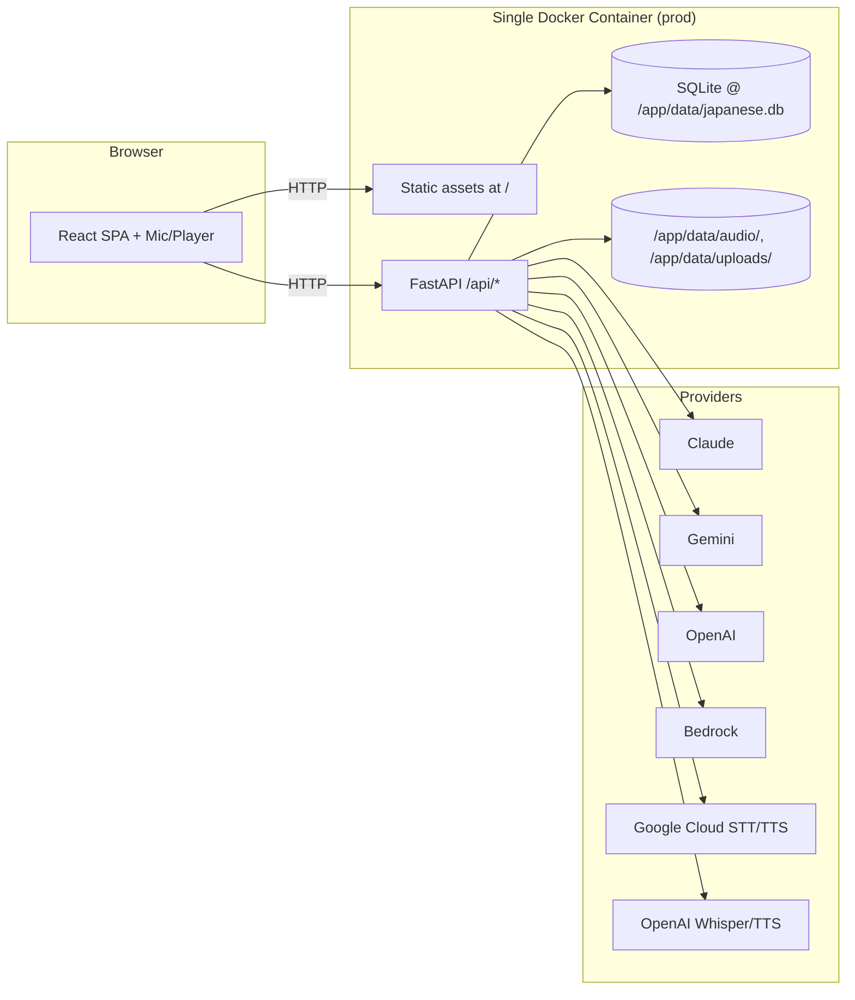
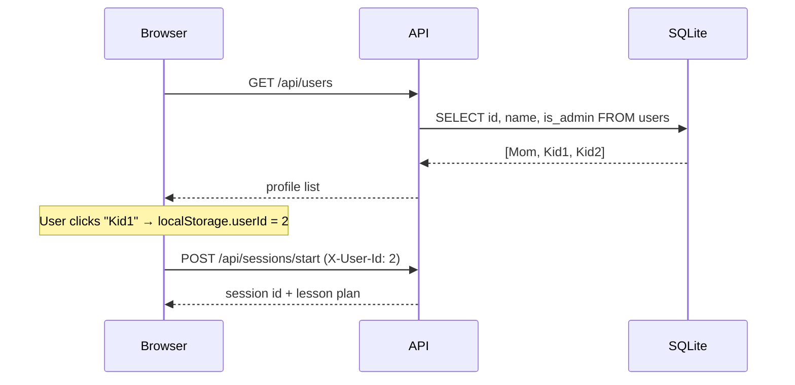
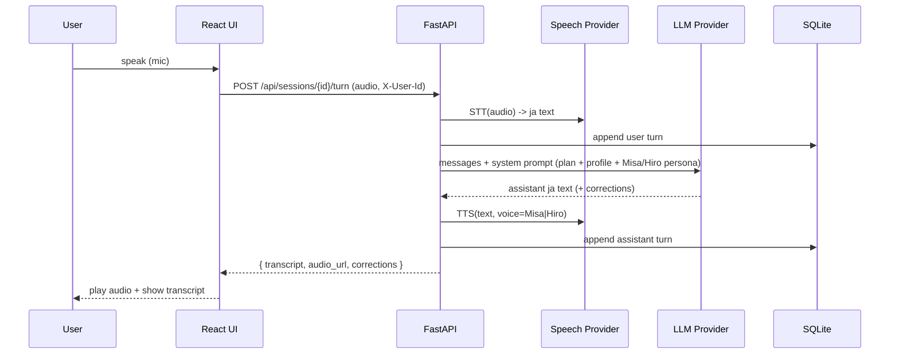

# Implementation Plan — Japanese Conversation Practice App

> **Status: ALL 15 TASKS COMPLETE.** This plan is now a historical reference
> document. See `README.md` for current usage instructions.

## Problem Statement

Build a self-hosted web application that helps a family of three (one parent admin + two teenage children) practice Japanese conversation with an AI tutor. The tutor follows a kid-friendly, Marugoto-inspired curriculum, supports voice-based conversation, accepts uploaded textbook screenshots to seed sessions, and maintains a personalized learning profile per user that grows smarter over time. The app is deployed to a home Unraid 7.2.2 NAS, follows the same simple operational model as the family's existing `kana-flash` app (https://github.com/namdle/kana-flash), and uses a trust-based profile picker rather than real authentication.

## Requirements Summary

| Area | Decision |
|---|---|
| Stack | React (Vite + TS) frontend, Python FastAPI backend |
| LLM | Pluggable: Anthropic Claude (default), Gemini, OpenAI, AWS Bedrock |
| Image input | LLM-native vision (no separate OCR) |
| Speech | Pluggable: Google Cloud STT/TTS (default, Neural2 ja-JP), OpenAI Whisper/TTS alt; voices named **Misa** (female) and **Hiro** (male) |
| Interaction | Voice-based with on-screen transcript |
| Curriculum | Kid-friendly, Marugoto-inspired topic taxonomy + admin-authored markdown lesson plans; LLM uses approved plans as input |
| Session mode | User-selectable per session: free-form OR structured 3-phase (warm-up → main → wrap-up) |
| Corrections | User-toggleable: immersion vs English-explained, end-of-turn vs end-of-session |
| Profile | Standard: level, lessons completed, vocab, grammar points, mistakes, topics of interest |
| Auth | None — profile picker (kana-flash style); `users(id, name, is_admin)`; `X-User-Id` header from `localStorage` |
| Admin | `is_admin` flag on a profile gates the lesson plan editor and family overview |
| Database | **SQLite** with WAL mode, single file under `./data/`. Schema bootstrapped via `init_db()` running idempotent `metadata.create_all(engine)`. **No Alembic.** |
| DB access layer | **SQLAlchemy Core** (typed table definitions + parameter-bound queries). No full ORM. |
| UI | Clean, neutral palette (warm grays + single muted accent), minimal graphics, conversation-focused |
| Hosting | Single Docker container on Unraid 7.2.2; deployed via `deploy.sh` + `.deploy-config` (kana-flash pattern). LAN-only initially; Cloudflare Tunnel + **Cloudflare Access (email allowlist)** for remote access later. App lives at `/mnt/user/appdata/japanese-study/` |
| Kid-friendliness | Topics emphasize family, friends, school, hobbies, daily life; avoid corporate/business contexts |

## Background

- **kana-flash patterns adopted (in spirit, not literally):** profile-based no-password access, SQLite in `./data`, single container in prod, `deploy.sh` + `.deploy-config.example`, `/mnt/user/appdata/<app>` deploy path, `restart: unless-stopped`, `init_db()` style schema bootstrap.
- **Stack difference from kana-flash:** FastAPI/Python backend (chosen for AI/personalization headroom). Single-container prod bundles the built React app and FastAPI serves it as static assets at `/`. API at `/api/*`. Dev uses two services (FastAPI `--reload` + Vite dev server) for hot reload.
- **Database choice rationale:** at 3 users with ~1 row written every 30s during a session and DB size projected under 100 MB, SQLite + WAL handles this comfortably. Backup = `cp japanese.db`. Escalation triggers documented: open beyond family → revisit; vector search at 100k+ embeddings → consider sqlite-vec or Postgres.
- **Marugoto curriculum:** topic/lesson/can-do structure adapted with kid-friendly topic selection and our own can-do phrasings (no copyrighted content reproduced).
- **Auth posture:** trust-based on LAN. When the Cloudflare Tunnel is enabled, Cloudflare Access provides the real auth boundary at the network edge — the app itself stays auth-free.

## Proposed Solution

### Architecture



### Profile-Based "Auth"



- No passwords. `X-User-Id` header carried with each request.
- `is_admin=1` profiles see the lesson editor and family overview.
- When Cloudflare Tunnel is enabled, gate access at the tunnel level via Cloudflare Access (email allowlist).

### Conversation Turn Flow



### Data Model (SQLite, SQLAlchemy Core)

- **users** — `id, name UNIQUE, is_admin INTEGER DEFAULT 0, level TEXT DEFAULT 'A1', voice TEXT DEFAULT 'Misa', llm_provider TEXT DEFAULT 'claude', speech_provider TEXT DEFAULT 'gcloud', correction_style TEXT, explanation_language TEXT, created_at`
- **topics** — `id, code, title_en, title_ja, level, kid_friendly, sort_order`
- **lessons** — `id, topic_id, code, title_en, title_ja, can_dos_json, sort_order`
- **lesson_plans** — `id, lesson_id, body_markdown, status ('draft'|'approved'), version, updated_at, updated_by`
- **sessions** — `id, user_id, lesson_plan_id NULL, mode, tutor_voice, llm_provider, speech_provider, started_at, ended_at, summary, profile_snapshot_json`
- **session_turns** — `id, session_id, role, text, audio_path, corrections_json, created_at`
- **vocab_items** — `id, user_id, jp, reading, en, mastery, first_session_id, last_seen_at` UNIQUE(user_id, jp)
- **grammar_points** — `id, user_id, code, example_jp, notes, mastery, last_seen_at` UNIQUE(user_id, code)
- **mistakes** — `id, user_id, session_id, mistake_type, original, corrected, note, created_at`
- **topic_interests** — `id, user_id, keyword, weight` UNIQUE(user_id, keyword)
- **uploads** — `id, user_id, path, mime, created_at`

Schema lives in `backend/app/db.py` as SQLAlchemy Core `Table` definitions. `init_db()` runs `metadata.create_all(engine)` (idempotent equivalent of `CREATE TABLE IF NOT EXISTS`) on startup. SQLite pragmas: `journal_mode=WAL`, `foreign_keys=ON` (set via SQLAlchemy `event.listen` on `connect`).

### Project Layout

```
japanese-study/
├── PLAN.md                     # this plan, written first
├── docker-compose.yml          # dev: frontend + backend with hot reload
├── docker-compose.prod.yml     # prod: single container
├── Dockerfile                  # multi-stage: build React, run FastAPI
├── deploy.sh                   # mirrors kana-flash
├── .deploy-config.example
├── .env.example                # provider keys
├── README.md
├── data/                       # gitignored: sqlite + audio + uploads
├── backend/
│   ├── pyproject.toml
│   ├── seed_users.py           # CLI: create/edit/promote profiles
│   └── app/
│       ├── main.py             # FastAPI; serves /api/* and static / in prod
│       ├── config.py
│       ├── db.py               # SQLAlchemy Core tables + init_db() + WAL pragma
│       ├── deps.py             # current_user from X-User-Id
│       ├── api/
│       │   ├── users.py
│       │   ├── chat.py
│       │   ├── sessions.py
│       │   ├── curriculum.py
│       │   ├── profile.py
│       │   └── uploads.py
│       ├── llm/                # provider adapters (claude, gemini, openai, bedrock)
│       ├── speech/             # provider adapters (gcloud, openai)
│       ├── curriculum/         # taxonomy seed + plan service
│       ├── session/            # orchestrator + prompt builder
│       └── profile/            # capture + retrieval
└── frontend/
    ├── package.json
    ├── vite.config.ts
    └── src/
        ├── routes/
        ├── components/
        ├── hooks/              # useProfile, useMic, usePlayer, useSession
        ├── api/
        └── styles/
```

### Provider Abstractions

```python
# backend/app/llm/base.py
class LLMProvider(Protocol):
    name: str
    def chat(self, messages: list[Message], *, system: str, images: list[bytes] | None = None,
             temperature: float = 0.6, stream: bool = False) -> ChatResponse: ...

# backend/app/speech/base.py
class SpeechProvider(Protocol):
    name: str
    def transcribe(self, audio: bytes, language: str = "ja-JP") -> str: ...
    def synthesize(self, text: str, voice: TutorVoice, language: str = "ja-JP") -> bytes: ...
```

`TutorVoice` is an enum (`MISA`, `HIRO`) mapped per-provider to the best available `ja-JP` female/male voice.

### Tutor Persona Prompt (sketch)

```
You are {voice_name} ({gender}), a friendly Japanese tutor for a learner named {user.display_name},
age-appropriate for teens and adults. Speak naturally in Japanese at level {user.level}.
Avoid corporate/business contexts; favor family, friends, school, hobbies, food, daily life.

Today's lesson plan:
{approved_lesson_plan_markdown}

Recent vocabulary the learner knows: {top_vocab}
Common mistakes to gently reinforce: {recent_mistakes}
Topics of interest: {topics}

Mode: {freeform|three_phase}
Corrections: {immersion|english_explained}, {end_of_turn|end_of_session}
```

---

## Task Breakdown

Each task delivers a working, demoable increment. Tests written alongside.

### Task 1: Project skeleton & dev Docker Compose
**Objective:** Monorepo with FastAPI backend, React+Vite+TS frontend, `docker-compose.yml` for dev with hot reload. SQLite at `./data/japanese.db` with WAL pragma. `/api/healthz` returns OK; frontend pings it.
**Guidance:** SQLAlchemy Core `MetaData` + `Engine` configured with `journal_mode=WAL` and `foreign_keys=ON` via `event.listen`. `init_db()` called at startup runs `metadata.create_all(engine)`. `.gitignore` excludes `data/`. Add `ruff` for Python, `eslint` + `prettier` for TS. Use Python 3.12, `uvicorn --reload`, Vite dev server proxying `/api/*` to backend.
**Tests:** Pytest for `/api/healthz`; Vitest snapshot for the home page.
**Demo:** `docker compose up` boots the stack; the browser shows "Backend healthy" via API call.

### Task 2: Profile management (kana-flash-style, no auth)
**Objective:** Implement `users` table and `/api/users` CRUD (`GET`/`POST`/`PATCH`/`DELETE`). Add `seed_users.py` CLI for initial population and an `is_admin` toggle. Build the profile-picker landing page; selected `userId` saved to `localStorage`. All API calls send `X-User-Id` header.
**Guidance:** Mirror kana-flash's API shape (`{ id, name, is_admin, ... }`). "Switch profile" action in the header. A FastAPI dependency `current_user(X-User-Id)` resolves the user. Admin guard dependency returns 403 for non-admin.
**Tests:** API CRUD tests; admin-route guard returns 403 for non-admin; CLI test creates and promotes a user.
**Demo:** Open the app → profile picker → click a name → app shows their dashboard placeholder. Add/rename/delete profiles via settings.

### Task 3: LLM provider abstraction with Claude (text-only)
**Objective:** `LLMProvider` interface + Anthropic Claude adapter. `POST /api/chat` returns Claude's reply. Minimal text chat UI to validate the loop.
**Guidance:** `anthropic` SDK. Tutor persona prompt embeds the user's chosen voice name (Misa/Hiro), even in text-only mode. A small `provider_router` picks a provider by user preference (default: claude).
**Tests:** Adapter unit tests with mocked SDK; integration test for `/api/chat` with mocked provider.
**Demo:** From a profile, type Japanese, get a Japanese reply attributed to Misa or Hiro.

### Task 4: Add Gemini, OpenAI, Bedrock LLM providers + per-profile selection
**Objective:** Adapters for `google-genai`, `openai`, `boto3` Bedrock. Per-profile `llm_provider` setting in user preferences UI. All adapters accept optional images (multimodal-ready, used in Task 10).
**Guidance:** Common `chat()` signature. Provider keys via env vars. Clear error if a provider's key is missing. All adapters share the same `LLMProvider` Protocol.
**Tests:** Adapter contract tests with mocks for each provider; settings UI test.
**Demo:** Switch provider in settings → next chat reply comes from the selected provider.

### Task 5: Speech provider abstraction with Google Cloud + Misa/Hiro voices
**Objective:** `SpeechProvider` interface + Google Cloud adapter (STT + Neural2 `ja-JP` TTS). Misa→female voice (e.g., `ja-JP-Neural2-A`), Hiro→male voice (e.g., `ja-JP-Neural2-B` or -D). Browser captures mic via `MediaRecorder` (webm/opus); backend transcribes, calls LLM, synthesizes reply, returns audio + transcript.
**Guidance:** Audio saved under `./data/audio/<session_id>/<turn_id>.opus|wav`; served via `/api/audio/...`. Use `google-cloud-speech` and `google-cloud-texttospeech`.
**Tests:** Adapter unit tests with mocked clients; end-to-end happy path with fixture audio.
**Demo:** Click mic, speak Japanese, see transcript, hear Misa or Hiro respond — full voice loop.

### Task 6: Add OpenAI speech provider + per-profile selection
**Objective:** OpenAI Whisper STT + OpenAI TTS adapter conforming to the same interface. Map Misa/Hiro to appropriate OpenAI voices. Per-profile `speech_provider` preference.
**Guidance:** Use `openai.audio.transcriptions` and `openai.audio.speech`. Pick OpenAI voices that fit the Misa/Hiro personas based on prosody.
**Tests:** Adapter unit tests; settings flow test.
**Demo:** Switch speech provider in settings; voice loop continues to work with the alternative.

### Task 7: Curriculum taxonomy + admin lesson plan editor
**Objective:** Seed kid-friendly topic taxonomy mirroring Marugoto structure (own can-do phrasings) covering levels A1–B1. Implement `lesson_plans` model with markdown body and `draft`/`approved` workflow. Build admin-only editor UI.
**Guidance:** Seed `backend/app/curriculum/seed.py` with topics: Greetings, Family & Home, School Life, Friends & Hangouts, Hobbies & Free Time, Food & Cooking, Daily Routines, Travel & Places, Festivals & Celebrations, Anime/Manga & Pop Culture, Sports & Outdoors, Pets & Animals. Editor: textarea + `react-markdown` preview pane; admin-only via `is_admin` check. Plans have `draft`/`approved` status; only `approved` plans usable in sessions. Seeding is idempotent.
**Tests:** Seed/idempotency tests; CRUD tests; admin-guard test (non-admin gets 403).
**Demo:** Admin profile browses topics → opens a lesson → edits markdown → approves it. Non-admins see curriculum read-only.

### Task 8: Session orchestrator (curriculum-driven)
**Objective:** "Start session" flow: pick the next approved lesson plan based on user level + completion history; build the system prompt (plan + tutor persona); run a voice conversation; persist `sessions` and `session_turns`.
**Guidance:** A `SessionOrchestrator` composes the prompt from `(approved_lesson_plan, user_profile_snapshot, tutor_persona, mode, correction_prefs)`. Session-start screen shows the queued lesson title and a "Start" button.
**Tests:** Prompt-builder snapshot tests; full session lifecycle integration test (mocked LLM/Speech).
**Demo:** Learner clicks "Start session" → sees the lesson title → has a curriculum-aligned voice conversation → transcript persists in their session history.

### Task 9: Session modes + correction-style preferences
**Objective:** Per-session toggle (`freeform` | `three_phase`) and per-profile correction preferences (`immersion` vs `english_explained`, `end_of_turn` vs `end_of_session`). Prompt branches accordingly.
**Guidance:** For `three_phase`, prompt instructs Misa/Hiro to mark phase transitions (warm-up / main / wrap-up) and produce a wrap-up summary. End-of-session corrections render as a structured panel after "End session".
**Tests:** Prompt-builder tests for each combination; UI test confirms the chosen options are applied.
**Demo:** Same learner runs free-form and 3-phase sessions and observes different behavior; toggling correction style changes feedback delivery.

### Task 10: Image upload for textbook-seeded sessions (LLM vision)
**Objective:** "Upload textbook image" flow that creates an ad-hoc session whose system prompt is derived from the image (no curriculum lesson). Image sent as a multimodal part to the chosen LLM.
**Guidance:** File picker + drag-and-drop on the start screen. Store image under `./data/uploads/<user_id>/<uuid>.jpg`. First turn asks the LLM to identify topic/vocab/grammar at the user's level and propose a practice activity. Subsequent turns continue normal voice loop.
**Tests:** Multimodal request shape tests for each provider; happy-path test with fixture image.
**Demo:** Upload a textbook page photo → AI proposes a practice based on its contents → voice conversation begins around the page.

### Task 11: Learning profile capture (post-session extraction)
**Objective:** On session end, run a structured-output extraction pass (LLM in JSON mode) to enumerate new vocab, grammar points used, mistakes, and topic keywords. Persist into `vocab_items`, `grammar_points`, `mistakes`, `topic_interests`.
**Guidance:** Deduplicate by `(user_id, key)`. Mastery rules: encountered = +1 (cap 1); used correctly = +1; mistake = -1 (floor 0); cap 5. Store raw extraction JSON in the session row for traceability.
**Tests:** Extraction parser tests with fixture transcripts; idempotency test (running twice doesn't double-count).
**Demo:** Complete a session → profile shows newly captured vocab, grammar tags, and any mistakes recorded.

### Task 12: Learning profile use (personalize next session)
**Objective:** Inject a profile snapshot (top recent vocab, weakest grammar points, recurring mistakes, top topic interests) into the session system prompt. Sessions visibly reference past content.
**Guidance:** Cap snapshot size (top 30 vocab by recency, top 5 mistakes, top 3 topic interests) to control token cost. Persist `profile_snapshot_json` per session for reproducibility.
**Tests:** Prompt builder includes profile fields when present; snapshot drift test across sessions.
**Demo:** Run 2–3 sessions; on the third, Misa/Hiro naturally re-uses earlier vocab and gently revisits a recurring mistake.

### Task 13: Profile dashboard UI
**Objective:** Per-user dashboard showing proficiency level (with self-assessment buttons to bump A1→A2 etc.), lessons completed, vocab list with mastery indicator, grammar points with mastery, recent mistakes, topics of interest.
**Guidance:** Neutral palette (warm grays + a single muted accent like sage or slate). Components: lists, simple progress meters, accordions. No heavy charting in v1; keep it focused. Accessible (keyboard nav, contrast).
**Tests:** Component tests for each panel; accessibility audit.
**Demo:** Each family member opens their dashboard and sees their own up-to-date learning status.

### Task 14: Admin family overview
**Objective:** Admin-only "Family" page listing each profile with key stats and links to view (read-only) their dashboards and session histories.
**Guidance:** Reuse dashboard components in read-only mode. Strict `is_admin` guard at API and route level. Nothing editable here — view-only.
**Tests:** Admin-guard tests; read-only enforcement; non-admin denied.
**Demo:** Parent profile opens "Family" → sees both kids' progress at a glance and can drill into any past session transcript.

### Task 15: Production single-container build + Unraid deploy script + Cloudflare notes
**Objective:** Multi-stage `Dockerfile` (build React → copy `dist/` into FastAPI image; FastAPI serves static at `/` and API at `/api/*`). `docker-compose.prod.yml` runs one container with `./data` mounted. `deploy.sh` + `.deploy-config.example` mirror kana-flash. Add `cloudflared` as an opt-in second service in compose for later use, and document Cloudflare Access (email allowlist) as the auth boundary when the tunnel is enabled.
**Guidance:** Image based on `python:3.12-slim`; node build stage uses `node:20-alpine`. Pin versions. Healthcheck on `/api/healthz`. `restart: unless-stopped`. Default deploy path `/mnt/user/appdata/japanese-study/`. `README.md` documents Unraid 7.2.2 install steps and a section "Enabling remote access (Cloudflare Tunnel + Access)" describing the email-allowlist setup. `.env.example` lists provider keys (Anthropic, Google credentials path, OpenAI, AWS); `.deploy-config.example` lists `NAS_HOST` and `NAS_DEPLOY_PATH`.
**Tests:** A `make smoke-test` brings up the prod compose, hits `/api/healthz`, runs a scripted "create profile + tiny chat" flow, tears down.
**Demo:** Run `./deploy.sh` from your laptop → app rebuilds and restarts on the NAS → family connects via LAN URL and runs a full session end-to-end. Cloudflare Tunnel + Access can be enabled later by uncommenting the `cloudflared` service, setting one env var, and applying the email allowlist in Cloudflare's dashboard.

---

## Execution Notes

- **Stop after each task** for the user to review and confirm the demo before moving to the next task.
- **TDD where practical:** write tests alongside implementation, not after.
- **Verify each task** by running both backend pytest and frontend Vitest before declaring done; for tasks involving Docker, run `docker compose up` and confirm the demo flow works.
- **Pin dependency versions** in `pyproject.toml` and `package.json` from day one.
- **Do not commit** unless the user explicitly requests it.
- **Flag for confirmation** before any provider API calls that would incur cost during testing — prefer mocked tests for unit/integration; only hit real APIs when the user gives the green light.
